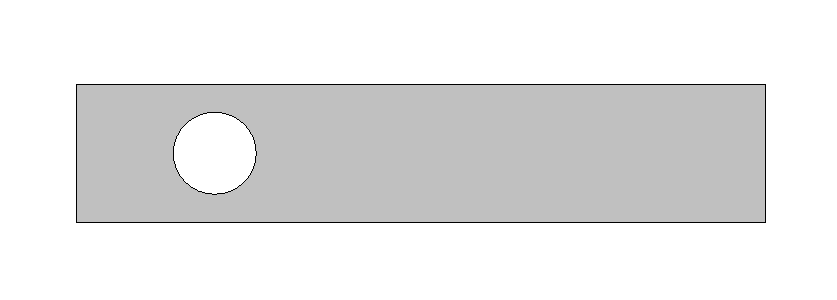

#  Basic workflow

On this page, you can find an example of a simple XL CAD workflow that draws a rectangular plate with a hole.

For more advanced examples and detailed information about individual instructions, please refer to the [Technical reference](../tec_ref/README.md) available in this documentation and to the **Examples** folder included with the XL CAD installation package.

The first instructions you need to define are the [Drawing resources](../tec_ref/instructions/resources/README.md). As you will see, these resources are referenced by the drawing instructions that follow.

The number and type of resources depend on the drawing you want to create. For this example, we will define only the resources required to produce the final result.

| | A | B | C | D | E | F |
| --- | --- | --- | --- | --- | --- | --- |
| **1** | [^^PEN](../tec_ref/instructions/resources/pen.md) | `PEN_BORDER` | `0` | `1` | `0` | `1` |
| **2** | [^^BRUSH](../tec_ref/instructions/resources/brush.md) | `BRUSH_BG` | `16777215` | `-1` |
| **3** | [^^BRUSH](../tec_ref/instructions/resources/brush.md) | `BRUSH_SOLID` | `12632256` | `-1` |

The resources defined above are used for:

1. The pen used to draw the plate outline.
2. The brush used to fill the hole (matching the worksheet background color).
3. The brush used to fill the plate.

Next, define the [Drawing instructions](../tec_ref/instructions/drawing/README.md) required to draw the rectangular plate with the hole.

| | A | B | C | D | E | F | G |
| --- | --- | --- | --- | --- | --- | --- | --- |
| **4** | [^^RECT](../tec_ref/instructions/drawing/rect.md) | `PEN_BORDER` | `BRUSH_SOLID` | `0` | `0` | `250` | `50` |
| **5** | [^^CIRCLE](../tec_ref/instructions/drawing/circle.md) | `PEN_BORDER` | `BRUSH_BG` | `-75` | `0` | `15` |

The instructions above produce the following drawing.

